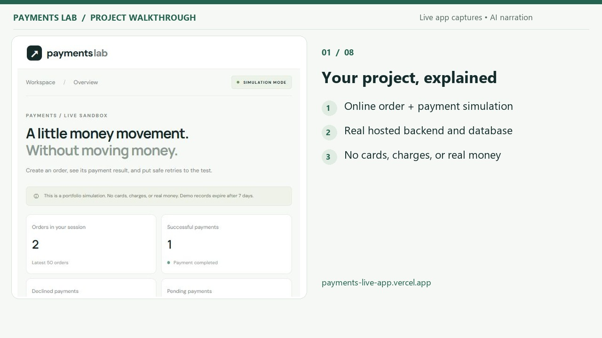
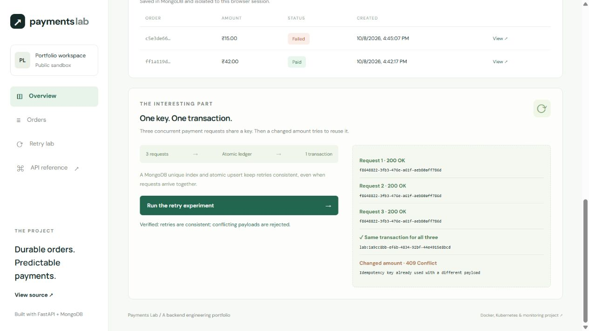

# Payments Lab

[Live app](https://payments-live-app.vercel.app) · [API reference](https://payments-live-app.vercel.app/api/docs) · [Backend health](https://payments-live-app.vercel.app/api/health)

A live, session-isolated payment simulation for the [Containerised Payments Microservices portfolio](https://github.com/vasun26shriya/containerised-payments-microservices).

Create paid or declined orders, retrieve persistent results, and run three concurrent payment requests followed by an idempotency conflict. No real payment provider, card data, or money movement.

## Video walkthrough

[](docs/demo/Payments-Lab-Explained-and-Live-Demo.mp4)

[Watch or download the 3:55 walkthrough (MP4)](docs/demo/Payments-Lab-Explained-and-Live-Demo.mp4) · [Transcript](docs/demo/Transcript.txt) · [Captions](docs/demo/Payments-Lab-Captions.srt)

The video explains the architecture and shows actual public-app captures of paid and declined orders, saved-result retrieval, and concurrent retry/conflict protection. It uses synthetic English narration and burned-in captions; pauses in the captured demo are shortened. The separate Docker/Kubernetes project is explained with a diagram, rather than presented as running on Vercel.

## Verified deployment

Deployed to the owner's Shriya Vercel account (`gigshield` workspace) with MongoDB Atlas on 8 October 2026. The public backend reports `ready` with MongoDB storage. Browser checks verified paid and declined orders, saved-order retrieval, persistence across page reload, three concurrent retries returning one transaction, and a changed payload returning HTTP 409. Automated integration tests use a real MongoDB instance.



The deployment uses Vercel Hobby and Atlas Free. These plans have usage limits; this app does not process real payments. No paid upgrade or payment card was required.

## Architecture

This Vercel edition runs a FastAPI application with an HTML/CSS/JavaScript frontend and an external MongoDB database. The original project retains independently deployed Docker/Kubernetes services, monitoring, and release drills. Vercel does not run that local Compose or Minikube stack as part of this app.

Payments use an atomic insert-once ledger with a unique `(session, key)` index. Orders start pending, then record the original payment result. Retrieving a pending order safely settles it with its original payment key, including when the payment was committed before an interrupted order update. There is no continuously running recovery worker in this serverless edition.

Each browser gets a random, HttpOnly, SameSite session cookie. Sessions isolate order and transaction access; they are bearer capabilities rather than user accounts. Records expire after 7 days, subject to MongoDB TTL cleanup. The latest 50 orders are shown. Requests are limited to 30 writes per session per minute. This is a public portfolio sandbox; a distributed attacker can create new sessions, so these limits are not comprehensive abuse protection.

## Local setup

Requires Python 3.13 and MongoDB. Start MongoDB with the original project's Docker Compose setup or a dedicated MongoDB instance.

```powershell
python -m venv .venv
.venv\Scripts\python -m pip install -r requirements.txt
$env:MONGO_URI='mongodb://127.0.0.1:27017'
$env:MONGO_DATABASE='payments_live_app'
.venv\Scripts\python -m uvicorn app:app --host 127.0.0.1 --port 18082
```

Open http://127.0.0.1:18082. Swagger is at `/api/docs`.

## Deploy on Vercel

Import this repository as a FastAPI project. Vercel detects `app.py`. Configure `MONGO_URI` as a sensitive production environment variable with a TLS MongoDB Atlas connection, and `MONGO_DATABASE=payments_live_app`. Use a dedicated database user that can access only this database. Never commit the connection string. Configure Atlas networking to allow the deployment using the narrowest network access available for your plan.

Alternatively, set `MONGO_HOST`, `MONGO_USERNAME`, and sensitive `MONGO_PASSWORD` separately. The server constructs and safely escapes the connection string without exposing the password to browser JavaScript. This permits transferring the password directly into the platform's protected settings. Hobby functions use changing outbound IPs; a public Atlas access-list rule may be needed on this free setup. Database authentication and TLS remain enabled.

Deploy the production branch and verify `/api/health` returns ready, then create and retrieve an order and run the retry experiment. A deployed page with a missing database is not a complete working deployment; health and writes return 503 until configured.

## Tests

Tests use a real MongoDB and a unique disposable database; teardown deletes only that generated test database.

```powershell
python -m pip install pytest==8.3.5 httpx==0.28.1
python -m pytest tests -q
```

Coverage: paid and declined orders, retrieval, session isolation, concurrent duplicate requests and payload conflicts, committed-payment recovery, validation, cross-origin protection, rate limits, and dependency readiness.

## Limitations

This app is a simulation and is not a production financial system. It has no identity accounts, provider integration, webhooks, refunds, settlement, or audit compliance. For durable unattended recovery use a task queue or scheduler. Production systems need authenticated users, stronger abuse controls, operational alerts, backups, and a defined retention policy.

## Contributors

Project team:

- [Shriya — @vasun26shriya](https://github.com/vasun26shriya)
- [@YASHO-26SINGH](https://github.com/yasho-26singh)
- [@SasyakSubudhi](https://github.com/SasyakSubudhi)

This section lists the project team. GitHub's automatic Contributors graph reflects commits merged into the repository.
