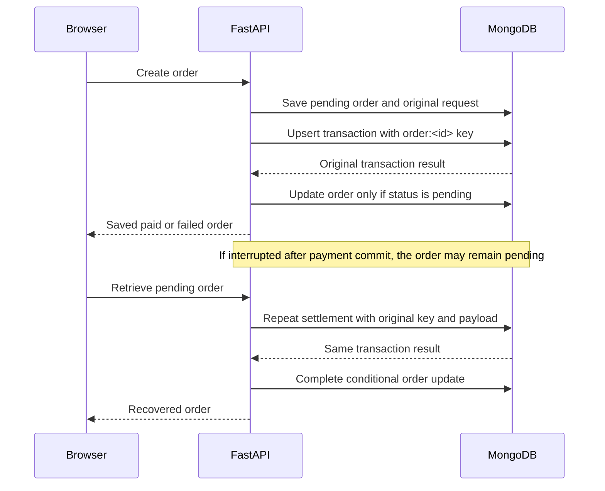

# Hosted backend contract and recovery

Prepared as an AI-assisted contribution for the connected Sasyak (`SasyakSubudhi`) account. This draft documents the current implementation and does not change attribution of earlier commits.

Base URL: https://payments-live-app.vercel.app. OpenAPI: `/api/openapi.json`; interactive reference: `/api/docs`.

## Requests and responses

| Method and route | Contract |
|---|---|
| `GET /api/health` | `200` with `status: ready`, `simulation: true`, and `storage: MongoDB`; `503` when the database is unavailable or unconfigured. |
| `POST /api/orders` | Creates an order and attempts settlement. A completed request returns `201` with the saved order. |
| `GET /api/orders` | Returns the newest 50 orders in the caller's session and `retention_days: 7`. It does not settle pending orders. |
| `GET /api/orders/{order_id}` | Retrieves one session-owned order and safely settles it if still pending. Returns `404` when inaccessible or absent. |
| `POST /api/payments` | Requires `Idempotency-Key`; returns a transaction result. Duplicate identical requests return the original result; a changed payload returns `409`. |

An order request has an integer `amount` from 1 to 100,000,000 minor units, a currency of `INR`, `USD`, `EUR`, or `GBP`, and an outcome of `success` or `failure`. Currency defaults to INR and outcome defaults to success. Extra fields and non-integer amounts are rejected with `422`. A payment request also requires `order_id` of 1–128 characters. The key is 1–128 characters.

```json
{"amount":4200,"currency":"INR","outcome":"success"}
```

The public order response exposes `id`, `amount`, `currency`, `status`, `transaction_id`, and `created_at`. Payment responses expose `transaction_id`, `status`, and the original `payload`. A simulated decline is a successful HTTP operation whose business status is `failed`.

## Session and idempotency boundaries

A random `payments_session` cookie scopes orders and transactions. It is HttpOnly, SameSite Strict, and Secure over HTTPS. Keep the same cookie when testing duplicate requests; a fresh session has a separate key namespace. The cookie is a bearer capability, not an authenticated user account.

The transactions collection has a unique compound index on `(session, key)`. An atomic upsert with `$setOnInsert` stores the payload, result, and transaction ID once. A concurrent duplicate-key race reads the winning record. The payload comparison includes `order_id`, amount, currency, and outcome; differences return `409`.

## Recovery sequence



This Vercel edition recovers on individual-order retrieval. It has no continuously running recovery worker. The original microservices edition uses bounded network retries and a background recovery worker. Never treat a transport error as proof that payment was declined.

## Operations and security limits

MongoDB credentials are server-side environment variables, never browser configuration. The production setup can use `MONGO_HOST`, `MONGO_USERNAME`, sensitive `MONGO_PASSWORD`, and `MONGO_DATABASE`; credentials are safely escaped when constructing the URI. Alternatively, configure a sensitive `MONGO_URI`.

Origin checks reject an explicit foreign Origin header. Thirty writes per session per minute are enforced in MongoDB. These controls do not provide full abuse protection: new sessions can bypass a per-session budget. Orders and transactions expire after seven days; rate buckets expire after two minutes, subject to TTL cleanup.

Integration tests verify paid/failed orders, retrieval, session isolation, eight concurrent duplicate payments with one ledger record, changed-payload conflicts, committed-payment recovery, validation, origin checks, rate limiting, and dependency health using a real MongoDB database.
